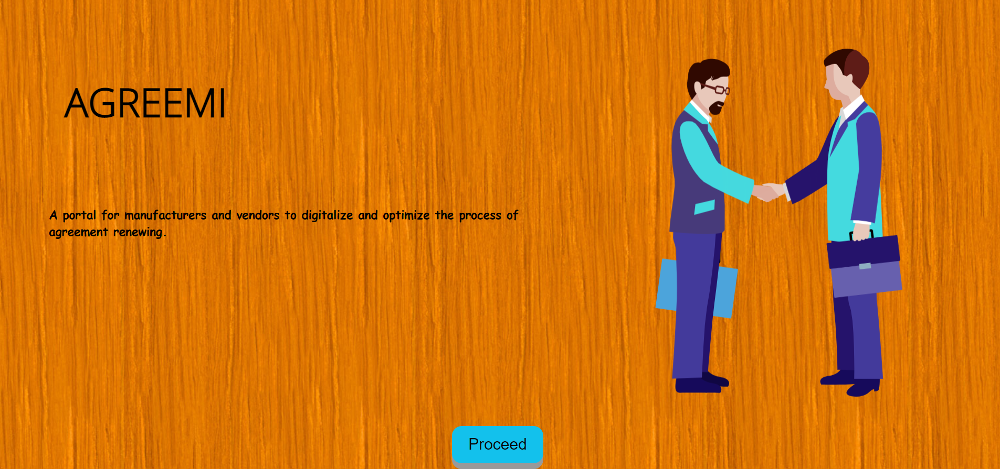
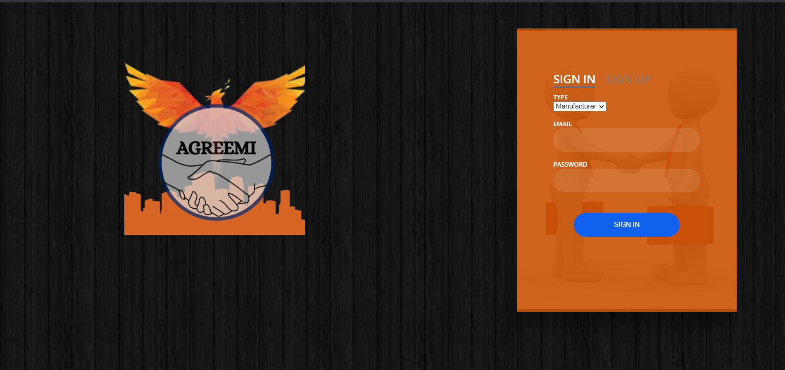
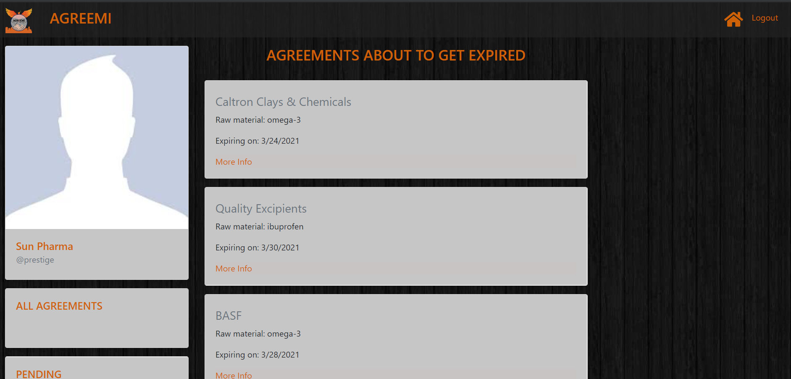
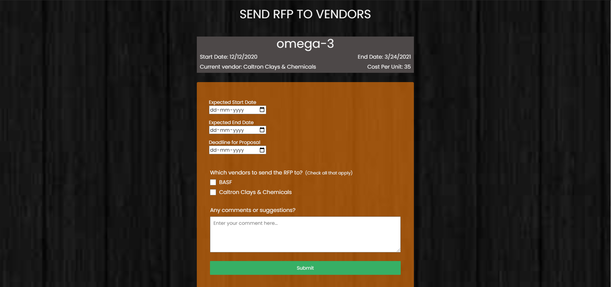

 

  <h1 align="center"><a href="https://agreemi.herokuapp.com/">Agreemi</a></h1>

  

    The portal for manufacturers and vendors to digitalize and optimize the process of agreement renewing
     
     
  

<!-- ABOUT THE PROJECT -->
### About The Project : Agreemi 
The current process of sorting,setting and renewing the agreements is tedious and full of confusion and chaos. To solve this problem we present to you <b>Agreemi</b>. With the motto of bridging the gap between manufacturers and vendors, agreemi promises to optimise and digitize the entire process and be a game changer in the industry.

## How it works
1) Manufacturers can view all agreements and send Request for Proposal for expiring agreements.

2) Vendors can reply with their proposals within the deadline.

3) Manufacturers can view all proposals in updates section and either negotiate or accept the proposal.

4) If the manfacturers negotiate, vendors can reply again with their proposal.

5) On acceptance the new agreement gets added to the list of all agreements.

## Features
1) View all agreements as well as a list of agreements expiring in the next 15 days.

2) Manufacturers can send Request For Proposal to all the vendors they wish.

3) Seamless negotiation with the stakeholders

4) Vendors can send their proposal in reply to all RFPs and negotiate as well

5) View all updates and pending agreements or RFPs

6) User friendly

## Built With
 HTML,CSS,JSS,Node.js,MongoDB,Express.js,Heroku  

## Implementation
- HTML,CSS,JavaScript for front-end
- Node.js in backend
- MongoDB and Express.js for the database
- Heroku for deployment

## Future Scope
- Built in real-time communication between vendors and manufacturers

## Have a look yourself!
<a href="https://agreemi.herokuapp.com/">https://agreemi.herokuapp.com/</a>

## Some Glimpses

 
    

  

 
    

  

 
    

  

 
    

## Contributors:
1) [Ritik Kumar](https://github.com/iamr-kumar)
2) [Muskan Agarwal](https://github.com/muskan278) 
3) [Sahil Kaling](https://github.com/sahildotexe)
4) [Vansh Karnwal](https://github.com/vanshkarnwal13)
5) [Alin Verma](https://github.com/skychazer)
6) [Ananyaa Gupta](https://github.com/Ananyaagupta)

	With ❤️ by BOTS.PY

